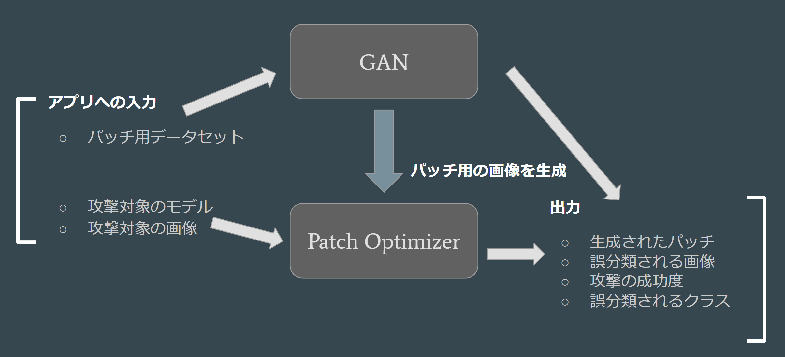
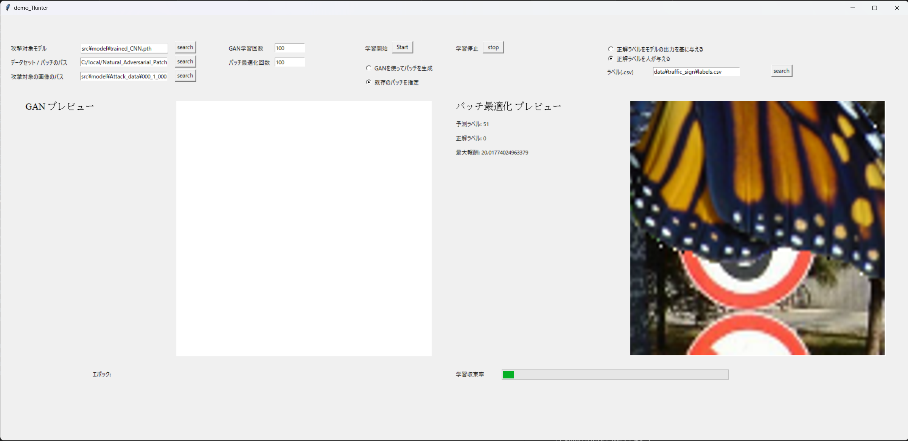

# Natural_Adversarial_Patch

## 説明

これは、機械学習ベースの画像分類器に対して、その判断を誤らせる攻撃(敵対的サンプル攻撃)を行うことができるツールです。



このツールの処理の概略は次のとおりです。

1. GANによってデータセットを模倣した画像を作成する。
2. 作成した画像をパッチとして、機械学習のモデルを誤らせるパッチの貼付け位置を探索する。
3. 2.で最適化された貼り付け位置に画像を貼り付け、分類器を通した結果を示す。

なお、**1についてはオプション**です。GANの変わりに、任意の画像をパッチとして貼り付けることもできます。
また、GANについては自前のデータセットを用いて学習させることもできます。

## 利用方法

### 依存パッケージのインストール

poetryをインストールして([参考url](https://qiita.com/ksato9700/items/b893cf1db83605898d8a))、
```poetry install```を実行するとライブラリがインストールされます。

<!-- 最初の方はコミットのたびにライブラリが増える可能性があるので、pullするたびに
```poetry install```をして、ライブラリをインストールしないといけないかも。 -->

### GAN用のデータセットの用意(オプション)

この項目はオプションです。以下の場合にはこの項目を実行する必要があります。

- GANを使って蝶の画像を生成したい場合

自作データセットを用いて画像を作成して、パッチを作成したい場合は次の項の指示に従ってください。

[Kaggle](https://www.kaggle.com/datasets/veeralakrishna/butterfly-dataset)からデータセットをダウンロードして、```data/leedsbutterfly```ディレクトリの下に```image```と```segmentations```を配置してください。

```poetry run python src/make_moth_data.py```を実行すると```data/leedsbutterfly/cropped```下に蝶のデータセットが作られます。

次に、GANで学習できるようにｋディレクトリを設定します。以下のコマンドを実行してください。
```bash
cd data
mkdir -p data/leedsbutterfly/dataset/class1
mv data/leedbutterfly/cropped/* data/leedsbutterfly/dataset/class1/
```

### 自作データセットでGANを学習させてパッチとしたい場合(オプション)

この項目はオプションです、以下の場合にはこの項目を実行する必要があります。

- GANを使って自作データセットを生成したい場合

データセットとしたい画像が入ったディレクトリを用意します。
このデータセットのディレクトリを以下、```data/dataset/```とします。

次に、GANで学習できるようにｋディレクトリを設定します。以下のコマンドを実行してください。
```bash
cd data
mkdir -p data/dataset/class1
mv data/dataset/* data/dataset/class1/
```
## 操作方法

以下のように実行するとGUIが立ち上がります

```bash
python3 -m src.main
```



以下の項目はGUI上で指定します。\
* 攻撃対象のモデルのパス
* GANに渡すデータセット / パッチに使う画像のパス（GANを利用するか否かで変えてください）
* パッチを貼る画像のパス
* ラベルを示すcsvのパス

テキストフィールドにエクスプローラからドラッグ&ドロップでパスを入力することもできます。
また、`paths.conf`に上記の順番でパスを記述しておくことで、起動時に自動で入力されます。
GANを使ったパッチの生成は利用するかしないか選択することができます。
最後にGANとパッチの位置の最適化のイテレーション回数を指定し、学習開始ボタンを押します。

学習開始後、各エポック終了時点で生成された画像がグリッド状に表示されます。GANのループが指定した回数分終了した後、生成された画像の左上の画像がパッチとして自動的に利用されます。パッチ最適化のフェーズでは、右側のキャンバスにパッチを貼った画像が表示されます。画像はパッチ最適化において攻撃成功度が向上した場合に更新されます。（張り付けられるパッチのサイズはハードコードされています。）

### 生成された画像の出力先

GANによって生成されたパッチは`export/GAN_generated_images`ディレクトリに出力されます。パッチをグリッド上にまとめたファイルは`grid.png`に出力し、それぞれのパッチは`image_{0-63}.png` に出力されます。パッチを貼った画像は新しく生成されるたびに`export/patched_image_{\d}.png`に出力されます。